# 🏗️ CI/CD Architecture - Professional Logging Library

## 📋 Overview

This document describes the complete CI/CD architecture for the Professional Logging Library, implementing GitFlow with automated testing, quality checks, and releases.

## 🔄 Workflow Architecture


## 🚀 Workflow Details

### 1. 🔍 **CI - Tests & Quality Checks** (`ci.yml`)

**Triggers:**
- Pull Requests to `development`, `master`, or `main`
- Manual execution (`workflow_dispatch`)

**Process:**
1. **Check Release Relevance** - Determines if changes require testing
2. **Maven Tests** - Unit and integration tests (Java 17)
3. **Code Quality** - SpotBugs, PMD, Checkstyle analysis
4. **Build Verification** - Package and verify artifacts
5. **Dependency Review** - Security vulnerability scan (PRs only)
6. **Summary Generation** - Comprehensive CI report

**Outputs:**
- Test results and coverage reports
- Code quality analysis
- Build artifacts
- PR comments with impact analysis

### 2. 📦 **Snapshot Release** (`snapshot-release.yml`)

**Triggers:**
- Push to `development` branch
- Only for relevant code changes (not docs/CI)

**Process:**
1. **Relevance Check** - Skip if only docs/CI changes
2. **Version Management** - Ensure `-SNAPSHOT` suffix
3. **Testing** - Run full test suite
4. **Build & Package** - Create JAR, sources, and Javadoc
5. **Snapshot Tag** - Create timestamped snapshot tag
6. **Pre-release** - Publish as GitHub pre-release

**Outputs:**
- SNAPSHOT version artifacts
- Pre-release for testing
- Development-ready packages

### 3. 🚀 **Auto Release** (`auto-release.yml`)

**Triggers:**
- Push to `master` or `main` branch
- Manual execution with version type selection

**Process:**
1. **Release Check** - Verify changes require release
2. **Version Increment** - Calculate new version (major/minor/patch)
3. **Testing & Validation** - Full test suite and verification
4. **Version Update** - Remove `-SNAPSHOT`, increment version
5. **Changelog Update** - Generate release notes
6. **Tag Creation** - Create and push release tag
7. **GitHub Release** - Create official release with artifacts
8. **Development Update** - Bump development to next SNAPSHOT

**Outputs:**
- Production release artifacts
- Official GitHub release
- Updated development version

## 📊 Version Management Strategy

### Development Branch (`development`)
```
Current: 1.2.3-SNAPSHOT
├── Feature merges → Tests → Snapshot release
├── Version stays: 1.2.3-SNAPSHOT
└── Artifacts: Pre-release snapshots
```

### Master Branch (`master`)
```
Merge from development → Auto-release
├── Release version: 1.2.3 (no SNAPSHOT)
├── Create tag: v1.2.3
├── GitHub release: Official
└── Next dev version: 1.2.4-SNAPSHOT
```

## 🔧 Branch Protection & Flow

```mermaid
graph LR
    subgraph "Branch Strategy"
        FEATURE[Feature Branches] --> DEV[development]
        DEV --> MASTER[master]
    end
    
    subgraph "Protection Rules"
        DEV --> PR_DEV[PR Required]
        PR_DEV --> CI_DEV[CI Must Pass]
        
        MASTER --> PR_MASTER[PR Required]
        PR_MASTER --> CI_MASTER[CI Must Pass]
        CI_MASTER --> REVIEW[Review Required]
    end
    
    subgraph "Automated Actions"
        DEV --> SNAP_AUTO[📦 Auto Snapshot]
        MASTER --> REL_AUTO[🚀 Auto Release]
    end

    style FEATURE fill:#e1f5fe
    style DEV fill:#f3e5f5
    style MASTER fill:#e8f5e8
    style SNAP_AUTO fill:#fff3e0
    style REL_AUTO fill:#e8f5e8
```



## 🛠️ Quality Gates

### Code Quality Checks
- **SpotBugs** - Static analysis for bug detection
- **PMD** - Code quality and best practices
- **Checkstyle** - Code style consistency
- **JaCoCo** - Test coverage reporting

### Security & Dependencies
- **Dependency Review** - Vulnerability scanning (PRs)
- **OWASP** - Security vulnerability assessment
- **License Compliance** - License compatibility check

### Testing Strategy
- **Unit Tests** - Individual component testing
- **Integration Tests** - Component interaction testing
- **Performance Tests** - Load and performance validation (manual)

## 📈 Artifact Management

### Snapshot Artifacts (Development)
```
Format: logging-library-1.2.3-SNAPSHOT.jar
Location: GitHub Releases (Pre-release)
Usage: Development and testing
Retention: 30 days
```

### Release Artifacts (Production)
```
Format: logging-library-1.2.3.jar
Location: GitHub Releases (Official)
Usage: Production deployment
Retention: Permanent
```

## 🔄 Conventional Commits & Versioning

### Commit Message Format
```
<type>(<scope>): <description>

[optional body]

[optional footer]
```

### Version Increment Rules
- **Major** (`2.0.0`) - Breaking changes (`feat!:`, `fix!:`)
- **Minor** (`1.1.0`) - New features (`feat:`)
- **Patch** (`1.0.1`) - Bug fixes (`fix:`, `chore:`, `docs:`)

### Examples
```bash
feat(logging): add structured logging support     # → Minor
fix(config): resolve configuration loading issue  # → Patch
feat!(api): redesign logging API interface       # → Major
```

## 🚨 Troubleshooting Guide

### Common Issues

#### CI Failures
1. **Test Failures** - Check test logs and fix failing tests
2. **Quality Gate Failures** - Review SpotBugs/PMD/Checkstyle reports
3. **Build Failures** - Verify Maven dependencies and Java version

#### Release Issues
1. **Version Conflicts** - Ensure proper version increment
2. **Tag Conflicts** - Check for existing tags, cleanup if needed
3. **Permission Issues** - Verify GitHub token permissions

#### Workflow Debugging
```bash
# Enable debug logging
ACTIONS_STEP_DEBUG: true
ACTIONS_RUNNER_DEBUG: true
```

## 📝 Maintenance & Updates

### Regular Tasks
- **Weekly** - Review and update dependencies
- **Monthly** - Update GitHub Actions to latest versions
- **Quarterly** - Review and optimize CI/CD performance

### Monitoring
- **GitHub Actions** - Monitor workflow execution times
- **Artifact Storage** - Monitor storage usage and cleanup
- **Security Alerts** - Review and address security advisories

## 🔗 Related Documentation

- [Contributing Guide](../CONTRIBUTING.md)
- [Development Setup](../README.md)
- [Release Notes](../CHANGELOG.md)
- [Security Policy](../SECURITY.md)

---

## 📞 Support

For CI/CD issues or questions:
1. Check [GitHub Actions](../../actions) for recent runs
2. Review this documentation
3. Create an issue with CI/CD label
4. Contact maintainers for urgent issues

**Last Updated:** $(date +"%Y-%m-%d")
**Version:** 1.0.0
