# 🚀 CI/CD Flow - Professional Logging Library

## 📋 Overview

Complete **GitFlow + CI/CD automation** with visual workflows for enterprise-grade development lifecycle.

## 🏗️ Branch Architecture


## 🔄 Complete Development Workflow


## 🎯 Feature Development Process


## 📦 Snapshot Release Flow


## 🚀 Production Release Pipeline


## 📊 CI/CD Automation Matrix


## 🕒 Release Timeline


## 🔧 Workflow Components

### 🎯 Check Release Relevance


### 📦 Version Management


## 🧹 Cleanup Strategy

```mermaid
flowchart TD
    A[Package Registry] --> B{Package Type}

    B -->|SNAPSHOT| C[Age Check]
    B -->|Release| D[Keep Forever]

    C -->|> 30 days| E[Delete]
    C -->|< 30 days| F{Count Check}

    F -->|> 3 versions| G[Delete Oldest]
    F -->|≤ 3 versions| H[Keep]

    style E fill:#ffebee
    style G fill:#ffebee
    style D fill:#e8f5e8
    style H fill:#e8f5e8
```



## 📈 Quality Gates


## 🌐 Integration Examples

### Maven Configuration

```xml
<!-- Development Testing -->
<dependency>
    <groupId>com.carlosmgv02</groupId>
    <artifactId>logging-library</artifactId>
    <version>0.0.5-SNAPSHOT</version>
</dependency>

<!-- Production Use -->
<dependency>
    <groupId>com.carlosmgv02</groupId>
    <artifactId>logging-library</artifactId>
    <version>0.0.4</version>
</dependency>
```

### Usage Example

```java
@RestController
public class PaymentController {

    @PostMapping("/payments")
    public ResponseEntity<PaymentResponse> processPayment(@RequestBody PaymentRequest request) {
        // Automatic tracing with sensitive data filtering
        CustomLogger.info("Processing payment for amount: {}", request.getAmount());

        try {
            PaymentResponse response = paymentService.process(request);
            CustomLogger.info("Payment successful - ID: {}", response.getId());
            return ResponseEntity.ok(response);

        } catch (PaymentException e) {
            CustomLogger.error("Payment failed for amount: {}", request.getAmount(), e);
            throw e;
        }
    }
}
```

## 📊 Metrics Dashboard


## 🎯 Benefits Summary

### ✅ **Fully Automated**
- Zero manual intervention for releases
- Automatic versioning from commit messages
- Intelligent cleanup of obsolete artifacts

### ✅ **Quality Assured**
- Mandatory tests before any release
- Multiple quality gates (SpotBugs, PMD, Checkstyle)
- Automatic security scanning

### ✅ **Developer Friendly**
- Immediate feedback on PRs
- Clear impact analysis documentation
- Simple setup for consumers

### ✅ **Enterprise Ready**
- GitFlow with complete automation
- Semantic versioning with conventional commits
- Robust artifact management

---

**Perfect for YouTube demonstrations:** Visual workflows, clear processes, and enterprise-grade automation showcase.

**Documentation Version:** 2.0.0
**Author:** Carlos Martinez Garcia-Villarrubia