# Professional Logging Library for Distributed Tracing

[](https://github.com/carlosmgv02/logging-library/releases/latest)
[](https://openjdk.java.net/projects/jdk/17/)
[](https://spring.io/projects/spring-boot)

## 🎯 Overview

A **production-ready Spring Boot library** that automatically adds **distributed tracing** to your microservices. Track requests across multiple services with **TraceId** and **SpanId**, preserving context even through database transactions.

## 🚀 Key Features

✅ **Automatic TraceId & SpanId injection** from HTTP headers
✅ **Transaction-aware context preservation** with AOP
✅ **SLF4J-style message formatting** (`logger.info("User {} created", userId)`)
✅ **Zero-configuration setup** with Spring Boot auto-configuration
✅ **ELK Stack integration** ready out-of-the-box

## 📊 How Distributed Tracing Works

### TraceId vs SpanId


- **TraceId**: Unique identifier that follows a request across ALL services
- **SpanId**: Individual operation identifier within a trace (one per service call)

### Request Flow Example


## 🔧 Quick Setup

### 1. Add Dependency

```xml
<dependency>
    <groupId>com.carlosmgv02</groupId>
    <artifactId>logging-library</artifactId>
    <version>0.0.2-SNAPSHOT</version>
</dependency>
```

### 2. Enable Transaction Support

Add to your `application.properties`:

```properties
# Enable automatic traceId preservation in @Transactional methods
logging.transaction.mdc.enabled=true
```

### 3. Basic Logback Configuration

Create `src/main/resources/logback-spring.xml`:

```xml
<?xml version="1.0" encoding="UTF-8"?>
<configuration>
    <appender name="CONSOLE" class="ch.qos.logback.core.ConsoleAppender">
        <encoder>
            <pattern>
                %d{HH:mm:ss.SSS} [%-5level] %logger{36} [traceId: %X{traceId:-} spanId: %X{spanId:-}] - %msg%n
            </pattern>
        </encoder>
    </appender>

    <root level="INFO">
        <appender-ref ref="CONSOLE"/>
    </root>
</configuration>
```

### 4. Start Logging with Context

```java
@RestController
public class UserController {

    @GetMapping("/users/{id}")
    public User getUser(@PathVariable String id) {
        // TraceId automatically available in logs
        CustomLogger.info("Finding user with id: {}", id);
        return userService.findById(id);
    }
}

@Service
@Transactional
public class UserService {

    public User findById(String id) {
        // TraceId preserved even in transactions!
        CustomLogger.info("Querying database for user: {}", id);
        return userRepository.findById(id);
    }
}
```

## 🌐 Microservice Communication

### Service A (Sender)

```java
@RestController
public class OrderController {

    @PostMapping("/orders")
    public Order createOrder(@RequestBody OrderRequest request) {
        // Automatically extract traceId from incoming request headers
        CustomLogger.info("Creating order for user: {}", request.getUserId());

        // Forward traceId to next service
        String response = restTemplate.exchange(
            "http://user-service/users/" + request.getUserId(),
            HttpMethod.GET,
            createRequestWithTracing(), // Utility method to add X-Trace-Id header
            String.class
        ).getBody();

        return orderService.create(request);
    }
}
```

### Service B (Receiver)

```java
@RestController
public class UserController {

    @GetMapping("/users/{id}")
    public User getUser(@PathVariable String id) {
        // Same traceId automatically available from X-Trace-Id header
        CustomLogger.info("Received request for user: {}", id);
        return userService.findById(id);
    }
}
```

### Example Log Output

```
14:32:15.123 [INFO ] OrderController [traceId: abc123 spanId: span1] - Creating order for user: user456
14:32:15.145 [INFO ] UserController [traceId: abc123 spanId: span2] - Received request for user: user456
14:32:15.167 [INFO ] UserService [traceId: abc123 spanId: span2] - Querying database for user: user456
```

## 🔄 Transaction Context Preservation

### The Problem
Spring's `@Transactional` creates proxies that can lose MDC context:

```mermaid
flowchart TD
    A[HTTP Request<br/>traceId: abc123] --> B[HTTP Filter<br/>✅ Sets MDC]
    B --> C[Controller<br/>✅ Has traceId]
    C --> D[Service Method<br/>@Transactional]
    D --> E[Spring Transaction Proxy<br/>❌ Loses MDC context]
    E --> F[Repository<br/>❌ No traceId]
```



### The Solution
Our AOP interceptor automatically preserves context:

```mermaid
flowchart TD
    A[HTTP Request<br/>traceId: abc123] --> B[HTTP Filter<br/>✅ Sets MDC + Backup]
    B --> C[Controller<br/>✅ Has traceId]
    C --> D[Service Method<br/>@Transactional]
    D --> E[AOP Interceptor<br/>✅ Restores from backup]
    E --> F[Repository<br/>✅ Has traceId]
```



## 🐳 ELK Stack Setup

Use our provided Docker Compose for instant setup:

```bash
# Download and start ELK stack
docker-compose up -d

# Your services will automatically send logs to:
# - Elasticsearch: http://localhost:9200
# - Kibana: http://localhost:5601
# - Logstash: localhost:5050
```

View distributed traces in Kibana by filtering on `traceId` to see the complete request journey across all your microservices.

## 📝 Advanced Usage

### Custom Trace Headers

```java
// Configure custom header names
logging.http.tracing.trace-header=X-Custom-Trace-Id
logging.http.tracing.span-header=X-Custom-Span-Id
```

### Message Formatting

```java
// SLF4J-style placeholders
CustomLogger.info("Processing order {} for user {} with total {}",
    orderId, userId, amount);

// With exception logging
try {
    processPayment();
} catch (PaymentException e) {
    CustomLogger.error("Payment failed for order {}", orderId, e);
}
```

### Sensitive Data Filtering

```yaml
logging:
  sensitive-data:
    enabled: true
    patterns:
      - "(?i)password[\\s]*[:=][\\s]*\\S+"
      - "(?i)token[\\s]*[:=][\\s]*\\S+"
      - "\\b\\d{16}\\b"  # Credit card numbers
```

---

## Author
**Carlos Martínez García-Villarrubia**
[GitHub Repository](https://github.com/carlosmgv02/logging-library)